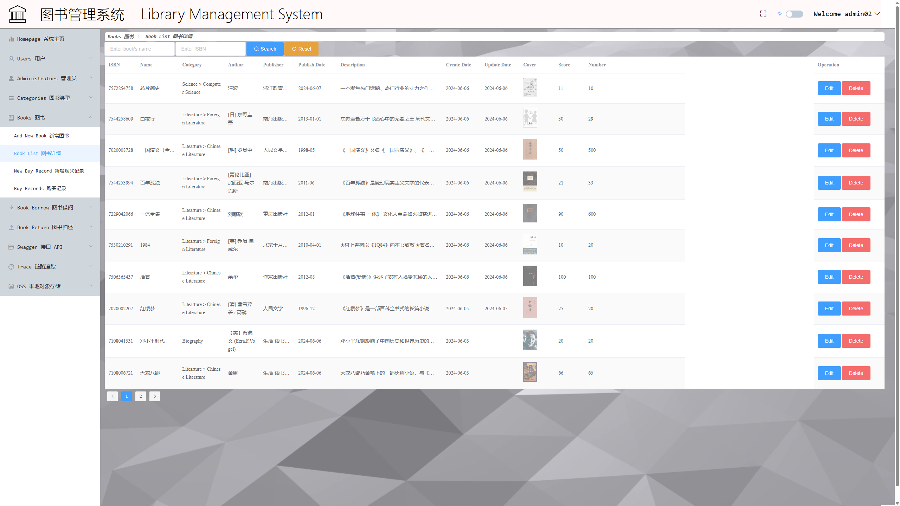
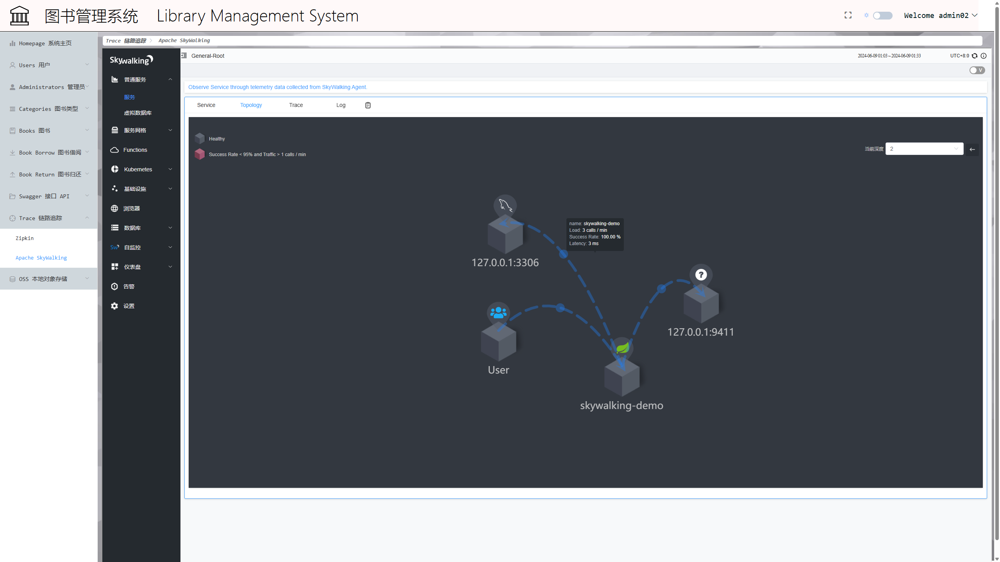

# 图书管理系统 Library Management System


## 简介

这是一个继承了多个服务的Spring Boot 2.7 + Vue 2.6 前后端分离Web项目。

## 安装

要运行此项目，你需要保证本地已安装了如下环境:

- Node.js 20 +
- Jdk 17 +
- Maven 3.9 +
- Docker Desktop latest
- Zipkin 3.4
- MySQL 8+
- Redis 5.0.10
- Skywalking-ui
- Skywalking-oap-server
- Skywalking-client-java

安装

1. 将项目直接克隆到IDEA, 或

```shell
git clone git@github.com:ZhaiJinPei/library-management-system.git
``` 

到本地用IDEA打开

2. 开启Docker服务，运行skywalking-ui和skywalking-oap容器
3. 进入zipkin-jar文件夹,以管理员运行CMD

```shell
java -jar  zipkin-server-3.4.0-exec.jar
```

启动zipkin

4. 进入minio文件夹,以管理员运行

```shell
.\minio.exe server D:\Net_Program\Net_MinIO\Data
```

启动minio

5. 启动Minio项目服务,参考链接：

> https://github.com/ZhaiJinPei/minio

6. 链接MySQL,进入项目sql文件夹,运行最新的转储文件创建成功库
7. 在SpringbootApplication运行配置中添加VM_OPTIONS选项,

> `-javaagent:F:\skywalking-agent\skywalking-agent.jar=agent.service_name=skywalking-demo,collector.backend_service=127.0.0.1:11800 `

8. 启动Spring Boot项目
9. 进入vue根目录

```shell
cd ./vue
```

10. 运行

```shell
npm i
```

11. 等待依赖加载完后,运行

```shell
npm run serve
```

启动vue项目

## 界面概览

### 主页


### 列表展示



### Swagger2 knife4j API 文档


### Zipkin 链路追踪


### Apache Skywalking



### Minio 对象存储


## 功能点

- [ ] 图书管理
- [ ] 借还购书管理
- [ ] 页脚许可、链接、联系方式
- [ ] 用户管理
- [ ] 管理员登录登出
- [ ] 修改密码
- [ ] 主页报表
- [ ] Swagger API 文档
- [ ] Zipkin 链路追踪
- [ ] SkyWalking 应用程序性能监视
- [ ] 文件上传 Minio OSS
- [ ] 封面大图查看
- [ ] 主题简单一键切换
- [ ] 一键全屏显示模式切换
- [ ] 图书类型管理
- [ ] 可伸缩侧边栏

